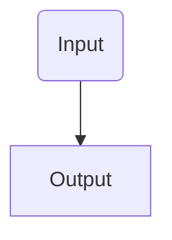

# Jarvis
A Jarvis style AI that lives in your computer, ready to serve your requests.

## What can it do?
Its an Ai that lives in your computer, and can do commands like make new projects, open apps and more to come!

## Security?
Anything related to downloading files from the web, or running terminal commands are strictly limited. It can at most access the web and make repos/vs code projects. It is also blocked from the network (unless you disable it and have a good internet provider).

## Potential general pipeline?

