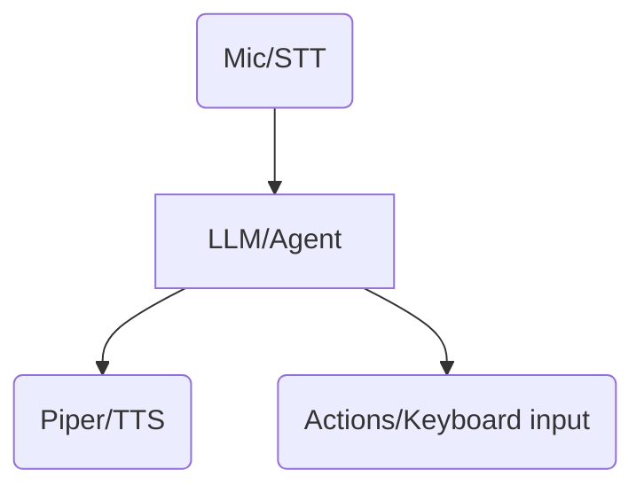

# Jarvis
A Jarvis style AI that lives in your computer, ready to serve your requests.

## What can it do?
Its an Ai that lives in your computer, and can do commands like make new projects, open apps and more to come!

## Security?
Anything related to downloading files from the web, or running terminal commands are strictly limited. It can at most access the web and make repos/vs code projects. It is also blocked from the network (unless you disable it and have a good internet provider).

## Potential general pipeline?

```mermaid
graph TD
  A(Mic/STT) --> B[LLM/Agent] 
  B --> C1(Piper/TTS)
  B --> C2(Actions/Keyboard input)
```
Input: Could be Mic or a wakeup call "Wake up daddys home" for example.

Ouptut: a pipeline of actions, creating media, even asking clarification questions as well.

## Models to be used?
So far we are using:

Agent: Qwen3.5 2b. This is big enough to have great agentic capability, whilst being able to fit on a laptop

STT: We are using faster-whisper because of its compatibility across platforms/code, there are probably better options though

TTS: Piper TTS is what we are using. Despite its quality, it can get a near **200x** real time audio speed with compatibility 
across devices of all sorts. We are looking to finetune piper to "sound" more like jarvis, but it hasnt been done yet.

Enviroment: So far, the idea is that it can input preset keyboard commands, though we are looking to use the Agents multimodel capabilities to control its actions (with safeguards).