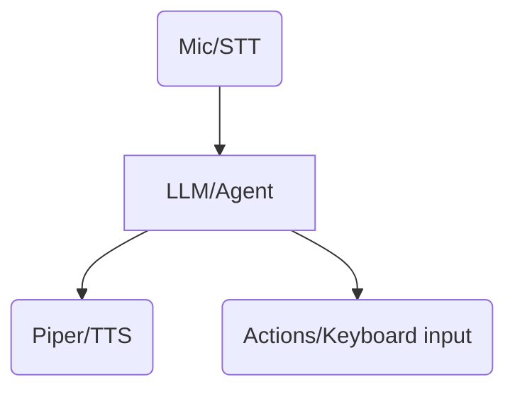

# Jarvis
A Jarvis style AI that lives in your computer, ready to serve your requests.

## What can it do?
Its an Ai that lives in your computer, and can do commands like make new projects, open apps and more to come!

## Security?
Anything related to downloading files from the web, or running terminal commands are strictly limited. It can at most access the web and make repos/vs code projects. It is also blocked from the network (unless you disable it and have a good internet provider).

## Potential general pipeline?

```mermaid
graph TD
  A(Mic/STT) --> B[LLM/Agent] 
  B --> C1(Piper/TTS)
  B --> C2(Actions/Keyboard input)
```
Input: Could be Mic or a wakeup call "Wake up daddys home" for example.

Ouptut: a pipeline of actions, creating media, even asking clarification questions as well.

## Models to be used?
So far we are using:

Agent: Qwen3.5 2b. This is big enough to have great agentic capability, whilst being able to fit on a laptop

STT: We are using faster-whisper because of its compatibility across platforms/code, there are probably better options though

TTS: Piper TTS is what we are using. Despite its quality, it can get a near **200x** real time audio speed with compatibility 
across devices of all sorts. We are looking to finetune piper to "sound" more like jarvis using huggingface datasets, but it has not been done yet.

Enviroment: So far, the idea is that it can input preset keyboard commands, though we are looking to use the Agents multimodel capabilities to control its actions (with safeguards).

## Environment setup

1. Install the requirements: `pip install -r requirements.txt`

2. Install torch with the right CUDA version for your system (see [pytorch.org](https://pytorch.org/get-started/locally/)), e.g. for CUDA 13.0:

   ```bash
   pip install torch torchvision torchaudio --index-url https://download.pytorch.org/whl/cu130
   ```
  other gpus may work better with different versions, so be sure to check the compatibility. If you don't have a compatible GPU, you can still run the model on CPU, but it will be much slower. 

   CPU only (if you dont have a gpu): `pip install torch torchvision torchaudio`
   
3. Download the [Piper TTS binary](https://github.com/rhasspy/piper/releases) and put it somewhere on your PATH (or next to `Piper_tts.py`)
   
4. Install [Ollama](https://ollama.com) and pull the model:

   ```bash
   ollama pull qwen3.5:2b
   ```

   `qwen3.5:9b` is an amazing option if you have 16 GB+ VRAM

6. Run the chatbot:
   - **Basic mode** (local transformers, no tools): `python mainchat.py`
   - **Agent mode** (Ollama + tool/MCP support): `USE_QWEN_AGENT=1 python mainchat.py`

## Voice training (optional)

To fine-tune Piper on a custom voice, install the extra deps first:

```bash
sudo apt install espeak-ng
pip install piper-phonemize --extra-index-url https://rhasspy.github.io/piper-phonemize/
pip install "piper-train @ git+https://github.com/rhasspy/piper.git#subdirectory=src/python"
```

Then run `python training/piperCustomVoice.py`

You can choose any dataset youd like, but be sure to not steal other peoples data (very bad).
we use open sourced datasets on huggingface.
